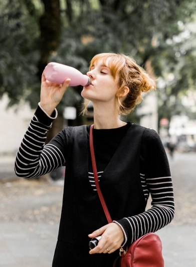
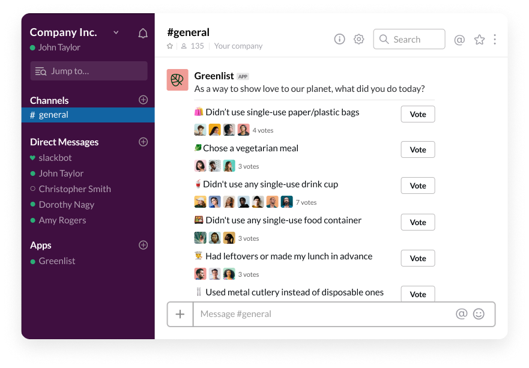
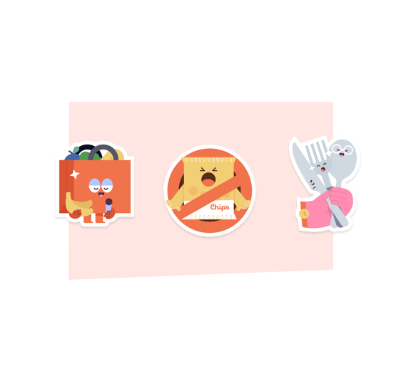
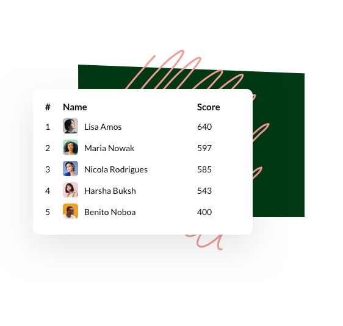

<!DOCTYPE html>
<html lang="en">
<head>
	<meta charset="UTF-8">
	<meta name="viewport" content="width=device-width, initial-scale=1.0">
	<link rel="stylesheet" href="assets/css/style.css">
	<link rel="preconnect" href="https://fonts.gstatic.com">
	<link href="https://fonts.googleapis.com/css2?family=ABeeZee&family=Roboto:wght@400;500&display=swap" rel="stylesheet">
	<link rel="stylesheet" href="https://stackpath.bootstrapcdn.com/bootstrap/4.1.3/css/bootstrap.min.css" integrity="sha384-MCw98/SFnGE8fJT3GXwEOngsV7Zt27NXFoaoApmYm81iuXoPkFOJwJ8ERdknLPMO" crossorigin="anonymous">
	<title>Greenlist</title>
</head>
<body>
		<!-- Menu -->
	<nav class="navbar navbar-expand-lg navbar-primary|secondary|success|danger|warning|info|light|dark bg-primary|secondary|success|danger|warning|info|light|dark">
			 
			 greenlist
			  <button class="navbar-toggler" type="button" data-toggle="collapse" data-target="#navbarSupportedContent" aria-controls="navbarSupportedContent" aria-expanded="false" aria-label="Toggle navigation">
			    
			  </button>
			
			  

			    <ul class="navbar-nav ml-auto">
			      <li class="nav-item active">
			        <a class="nav-link" href="#">Home (current)</a>
			      </li>
			      <li class="nav-item">
			        <a class="nav-link" href="#">Pricing</a>
			      </li>
			      <li class="nav-item dropdown">
			        <a class="nav-link" href="#" id="navbarDropdown" role="button" data-toggle="dropdown">
			          Support
			        </a>
			      </li>    
			    </ul>
			  

			</nav>

	<!-- Header -->
	<header class="header">
		

			

				<h1>Green   Revolution?   It's a team   effort.</h1>

				<button class="footer_btn">
					
					Connect to Slack
				</button>

				
Free 14 days trial, no credit card required.

			

		

	</header>

	<!-- Work -->
	<section class="work">
		

			
			<h1>
				Challenge your  
				team to make small, 
				sustainable choices  
				at work.
			</h1>

			

				

					

						Greenlist is a simple internal 	tool that empowers companies to start a sustainable office lifestyle while driving change in a way that feels natural. With both a fun and inspiring approach, Greenlist turns cutting down on plastic into a friendly in-company competition that celebrates individuals for their efforts.
					

				

			

				
		

	</section>

	<!-- Creative -->
	<section class="creative">
		

			

				

					<h1>
						Create a cleaner and   better world, on Slack.
					</h1>

					

						Whether it’s choosing reusable food and liquid containers or picking the vegetarian option for the office lunch, Greenlist allows anyone in your team to set a positive role model and influence other staff in being more cautious about plastic pollution and using resources sustainably.
					

					
				

			

		

	</section>

	<!-- Section 3 -->
	<section class="section">
		

			

				

					<h1>
						Educate employees
					</h1>

					

						Thanks to a point system based on the environmental impact of each action, Greenlist helps you educate your employees on sustainability while keeping them engaged.
					

				

				

					
				

			

			
			

				

					
				

				

					<h1 class="section_title">
						Celebrate achievements
					</h1>

					

						Greenlist celebrates your employee’s waste reduction achievements by giving custom designed badges so that they feel proud of the quantifiable difference they are making towards the plastic pollution crisis.
					

				

			

			
			

				

					<h1 class="section_title_3">
						Drive engagement
					</h1>

					

						Discover week by week how well your team is doing and which employee will get to the top of the monthly Green Leaderboard!
					

				

				

					
				

			

		

	</section>

	<!-- Footer -->
	<footer class="footer">
		

			<h1>Sign up to   Greenlist today.</h1>

			<button class="btn_header">
				
				Connect to Slack
			</button>
			
Free 14 days trial, no credit card required.

			

				Privacy & Terms
			

		

	</footer>
	
	<!-- Bootstrap -->
	
	
	
</body>
</html>
